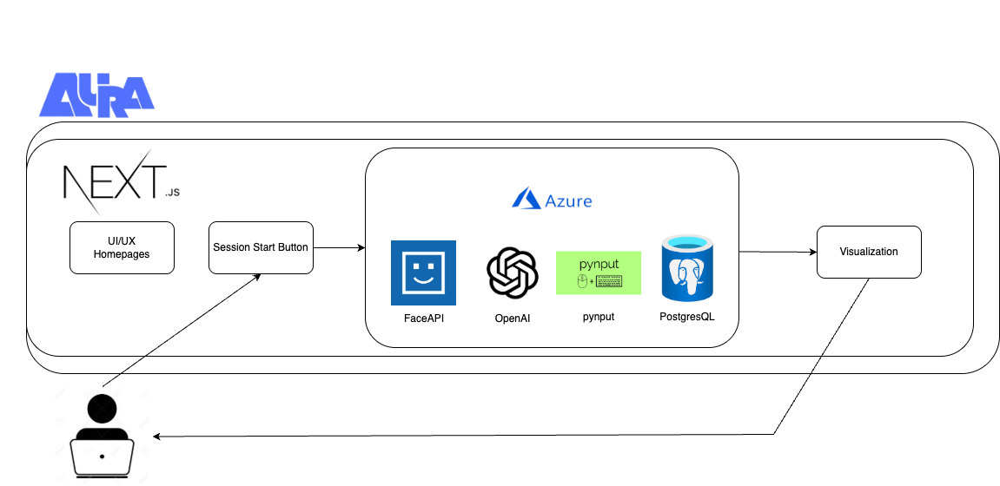

# Aura

An AI-driven productivity assistant that enhances focus by analyzing facial expressions, screen activity, and keyboard/mouse interactions. Provides real-time feedback, personalized coaching, and IoT-based environment optimization using Azure AI.

#TEAM

Euro Bae - eurobin39@gmail.com

Hong Shen - shenho@tcd.ie

Zicheng liang - liangzicheng02@gmail.com

# Work Efficiency Web Framework

## 🔍 Overview

This project helps evaluate and enhance productivity using:

- Azure Face API for facial expression-based focus detection
- Azure OpenAI for intelligent assistance
- Keyboard & Mouse tracking to monitor activity

---

## 🔄 Workflow Diagram

